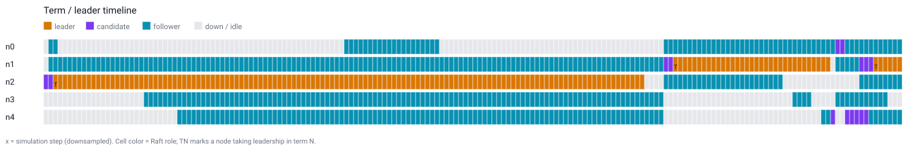
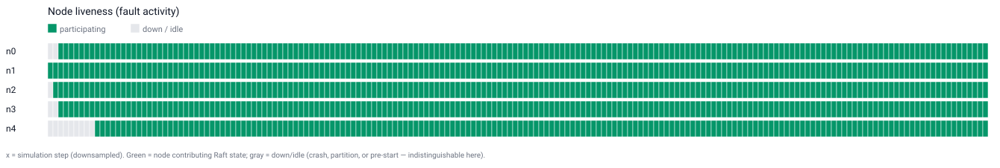

# quorum

[](https://github.com/billdmar/quorum/actions/workflows/ci.yml)
[](go.mod)
[](LICENSE)

**A Raft consensus implementation and replicated key-value store in Go, built
around a pure deterministic core and verified the way industry leaders verify
distributed systems** — deterministic simulation testing with injected faults,
Porcupine linearizability checking on every run, and Raft safety-invariant
monitors after every step.

> My cluster survived **140,000 adversarial fault schedules** — message loss,
> reordering, symmetric and asymmetric partitions, crashes, and fsync-boundary
> disk faults — with **zero Raft safety-invariant violations** and **every client
> history machine-checked linearizable** by Porcupine.

## Headline results

All numbers are measured, reproducible by a single documented command (see
[Reproduce every number](#reproduce-every-number)), and never published from a
busy machine or a non-release build.

| Metric | Result |
|---|---|
| Verified runs — verification () | **10,000** (1,000 seeds × 5-schedule base matrix × {3,5} nodes) |
| Verified runs — full gate () | **140,000** (10,000 seeds × 7-schedule full matrix × {3,5} nodes) |
| Raft safety-invariant violations | **0** |
| Non-linearizable histories (Porcupine) | **0** |
| Defects found & fixed by the verification process | 7 (2 pinned as regression seeds: `507`, `7503`) |
| Core-package coverage | **95.3%** (unit tests ∪ the  sweep) |
| Crash-recovery | converges under `crashy` + `disk-faulty` (kills at fsync boundaries) |
| Concurrency safety | `go test -race` clean; 60-run robustness sweep, 0 races |
| Throughput (3-node loopback, unbatched, 32 clients) | **~117k ops/sec**, p50 0.05 ms, **p99 4.8 ms** |

## What the cluster does under fault

Leadership changing hands as nodes crash and restart (`crashy` schedule, 5 nodes) —
each row is a node, time runs left→right, colour is Raft role, `TN` marks a node
taking leadership in term N:



Node participation under frequent partitions (`partition-heavy`, 5 nodes) — green =
participating, grey = down/partitioned/idle (derived from observable state; the
figure cannot distinguish crash from partition, and says so):



## The core idea

The Raft state machine is a **pure function**: it touches no clock, no I/O, no
goroutines, and no randomness. It consumes `Event`s (timer ticks, message
arrivals, client requests) and emits `Effect`s (send, persist, apply, arm timer)
that a *driver* executes. Two drivers share the identical core:

- a **deterministic simulator** ([`sim/`](sim)) that injects network, crash, and
  fsync-boundary disk faults on a seeded logical clock, and
- a **real-TCP production runtime** ([`node/`](node), [`rpc/`](rpc)) with real
  goroutines and timers.

Because the core is deterministic, the same seed reproduces a byte-identical event
trace (a trace-hash gate proves it). That property is what makes the verification
stack possible.

## Verification

- **Deterministic simulation testing (DST).** Thousands of seeded runs across a
  frozen [fault-schedule matrix](config/registry.go) — loss, duplication,
  reordering, symmetric/asymmetric partitions, crash/restart, and fsync-boundary
  disk faults. Same seed ⇒ identical trace hash.
- **Porcupine linearizability checking.** Every recorded client history is checked
  against a sequential KV model by an external oracle ([`check/model.go`](check/model.go)).
- **Five Raft safety-invariant monitors** after every step ([`check/invariants.go`](check/invariants.go)):
  election safety, log matching, leader completeness, state-machine safety, commit
  monotonicity. **Zero violations is the bar at every gate.**
- **Adversarial crash-recovery.** Durability of term/vote/log across kills at fsync
  boundaries; rejoin, InstallSnapshot catch-up, and convergence.
- **Exactly-once client sessions** proven under retries across leader changes;
  **race-detector-clean** runtime paths.

Every failing seed becomes a **committed regression test**, and no fault schedule,
seed floor, or invariant bound is *ever* relaxed to turn a red run green. The
verification process found **seven real defects**: six during the gated build (two
at the  verification, four at the  full gate — each in the test harness or a
monitor, none in Raft safety), plus one in the P6 membership feature caught by an
adversarial code review (log compaction silently reverted committed cluster
membership). Each was fixed at the root and pinned by a regression test — written
up in [`docs/DESIGN.md §12a/§12c/§15d`](docs/DESIGN.md).

## Quickstart — a 3-node cluster surviving a leader kill

```sh
# One command: build, launch a 3-node loopback cluster, put/get a key,
# KILL the leader, and show the value survive re-election.
./scripts/demo.sh
```

Or by hand:

```sh
go build -o bin/quorum ./cmd/quorum
# In three terminals (or backgrounded):
PEERS=N1=127.0.0.1:9001,N2=127.0.0.1:9002,N3=127.0.0.1:9003
./bin/quorum server -id N1 -peers "$PEERS" -client 127.0.0.1:8001 &
./bin/quorum server -id N2 -peers "$PEERS" -client 127.0.0.1:8002 &
./bin/quorum server -id N3 -peers "$PEERS" -client 127.0.0.1:8003 &

CLIENTS=N1=127.0.0.1:8001,N2=127.0.0.1:8002,N3=127.0.0.1:8003
./bin/quorum kv put -addr 127.0.0.1:8001 -peers "$CLIENTS" foo bar
./bin/quorum kv get -addr 127.0.0.1:8001 -peers "$CLIENTS" foo   # -> bar
```

## Reproduce every number

```sh
# verification (): 10,000 verified runs, base matrix × {3,5} nodes.
go test ./tests/integration/ -run TestSeedSweepG1 -timeout 30m -args -seeds=1000

# Full gate (): 140,000 verified runs, full matrix × {3,5} nodes.
go test ./tests/integration/ -run TestSeedSweepG2 -timeout 60m -args -seeds=10000

# Core coverage (95.3%): merge unit-test coverage with the  sweep's coverage.
D=$(mktemp -d)
go test -coverpkg=./core/... ./core/... -args -test.gocoverdir=$D
go test -coverpkg=./core/... ./tests/integration/ -run TestSeedSweepG2 -args -seeds=200 -test.gocoverdir=$D
go tool covdata percent -i=$D

# End-to-end throughput / latency (quiesced machine).
go test ./bench/ -bench Throughput -run '^$' -benchtime=2s

# The whole suite, race-clean.
go test ./... && go test -race ./node/... ./rpc/... ./sim/...
```

## Design highlights

Decision-by-decision in [`docs/DESIGN.md`](docs/DESIGN.md). A few:


- **Sans-I/O pure core** — one core, two interchangeable drivers (sim + real TCP);
  the key that makes DST possible.
- **The Figure-8 commit rule** — a leader commits a prior-term entry only
  transitively, once a current-term entry above it reaches quorum; a leader no-op
  on election provides the current-term anchor.
- **ReadIndex linearizable reads** — heartbeat-confirmed leadership before serving,
  so a partitioned-out leader can't serve a stale read (no disk write per read).
- **Exactly-once sessions** — per-client dedup that survives snapshots.
- **WAL + fsync discipline** — persist-before-send, CRC-framed torn-tail recovery,
  atomic temp+rename for hard state and snapshots.

## Beyond the core (stretch work)

Built on top of the gated core, each with its own tests and an honest
verification boundary (`docs/DESIGN.md §15`):

- **TLA+ safety model** ([`spec/`](spec)) — a hand-written TLA+ model of the
  algorithm, model-checked exhaustively by TLC (~322k states, 0 violations) on the
  same five invariants the Go monitors check. An exhaustive complement to DST.
- **Single-server membership changes** ([`core/config_change.go`](core/config_change.go))
  — add/remove one server at a time (Raft dissertation §4.1, no joint consensus):
  config-effective-on-append, one-at-a-time + current-term gates, revert-on-
  truncation. Live real-TCP test adds a 4th node to a running cluster and removes
  one; core unit tests pin the safety constraints. (Not folded into the 140k sweep
  — see §15d.)
- **Lease-based reads** ([`node/lease.go`](node/lease.go)) — a lower-latency
  read path trading a bounded-clock-skew assumption for ReadIndex's round-trip,
  with the clock-skew safety argument written out (§15c). Opt-in; ReadIndex stays
  the default.
- **Multi-raft sharding sketch** ([`shard/`](shard)) — the keyspace partitioned
  across independent Raft groups behind a deterministic router; a sketch of the
  scaling architecture, honest about what a production system would add.

## Honest limitations

A correctness-first, **single-machine / loopback** system. Throughput numbers are
loopback and unbatched (each client op is its own Raft round). The stretch work
above is verified by its own tests but is **not** integrated into the primary
140,000-run sweep (which uses a fixed cluster); that boundary is stated precisely
in `docs/DESIGN.md §15`. No production-scale hardening is claimed.

## Tech stack

- **Go 1.23+** (module pinned to `go 1.23`; dev toolchain in [`docs/ENV.md`](docs/ENV.md))
- **Standard library** for everything but the checker
- **[Porcupine](https://github.com/anishathalye/porcupine)** — linearizability oracle
- **golangci-lint** — lint/format (dev/CI tool)

## License

[MIT](LICENSE)
